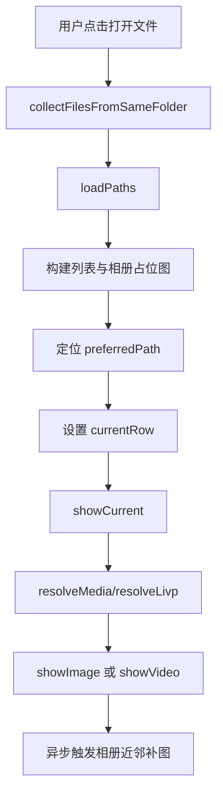
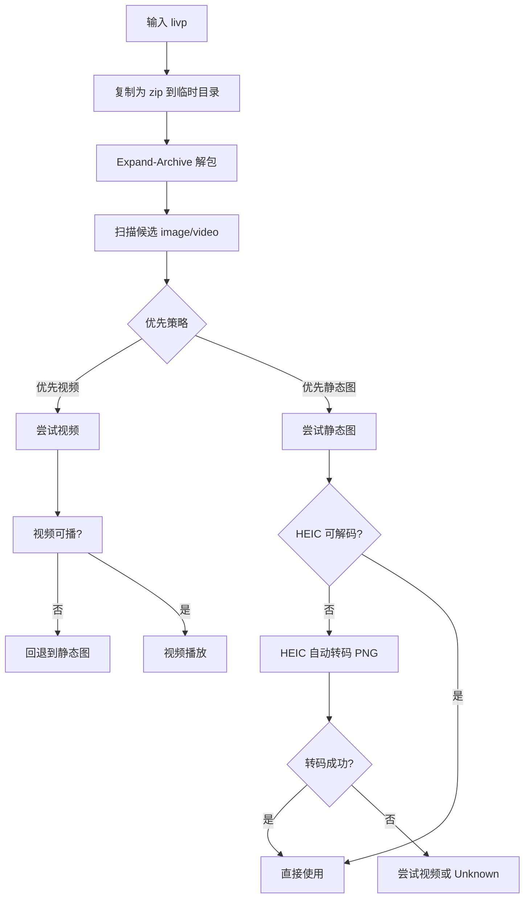
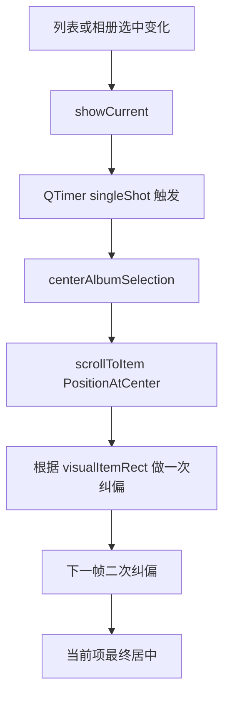
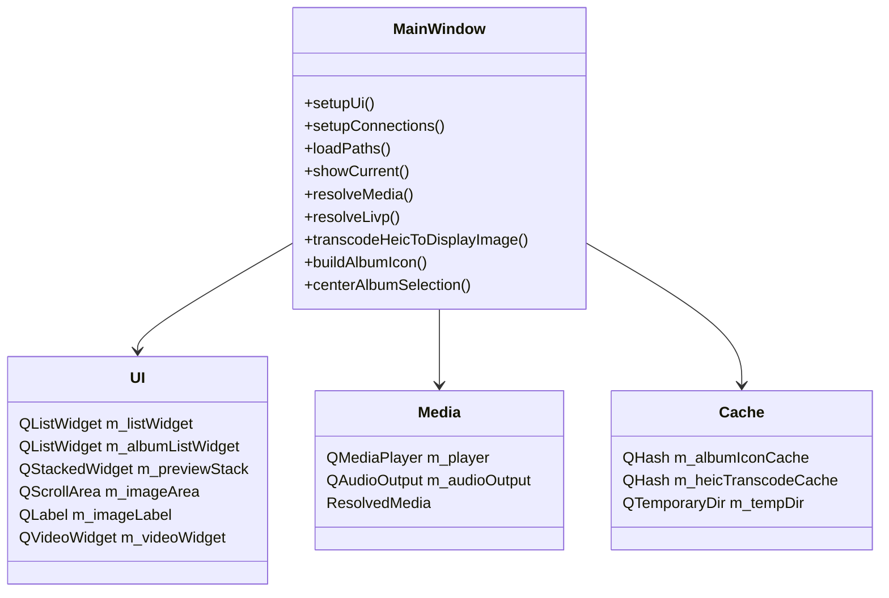

# MediaPreviewClient 项目文档

## 1. 项目概览

MediaPreviewClient 是一个面向 Windows 11 的 Qt6 本地媒体预览客户端，目标是对图片、视频、LIVP 进行快速浏览、切换和预览。

### 1.0 开发环境

- 开发主机: Windows 11 x86 架构
- UI 框架: Qt6 Widgets + Multimedia
- 构建体系: CMake + qmake 双支持

### 1.1 支持格式

- 图片: jpg, jpeg, png, bmp, gif, webp, heic
- 视频: mp4, mov, m4v, avi, mkv
- 实况: livp

### 1.2 核心能力

- 选择单文件后自动加载同目录文件
- 左侧历史浏览 + 中央预览 + 底部相册画板
- 图片缩放与居中预览
- 视频播放、进度、音量、快捷键
- LIVP 解包、候选资源解析、回退逻辑
- HEIC 自动转码（ffmpeg/magick）
- 相册画板当前项强制居中
- 历史浏览记录（不去重、可回看）
- 历史分组折叠（默认仅展开最后一组）
- 程序图标与任务栏图标
- 运行日志记录，便于排障

---

## 2. 架构设计

### 2.1 模块拆分

- 入口: [main.cpp](main.cpp)
- 主窗口初始化与日志: [mainwindow.cpp](mainwindow.cpp)
- UI 与信号连接: [mainwindow_ui.cpp](mainwindow_ui.cpp)
- 交互与列表联动: [mainwindow_interaction.cpp](mainwindow_interaction.cpp)
- 媒体解析与展示: [mainwindow_media.cpp](mainwindow_media.cpp)
- 缩略图与相册策略: [mainwindow_thumbnails.cpp](mainwindow_thumbnails.cpp)
- 对外接口与状态: [mainwindow.h](mainwindow.h)

### 2.2 逻辑分层

- UI 层: 构建控件、连接信号、处理输入事件。
- 应用层: 文件加载、选中同步、导航、状态维护。
- 媒体层: 格式识别、LIVP 提取、HEIC 转码、媒体渲染。
- 资源层: 临时目录、缓存、日志。

### 2.3 关键状态

- `m_files`: 当前目录已加载的文件列表
- `m_currentIndex`: 当前选中索引
- `m_albumIconCache`: 相册缩略图缓存
- `m_heicTranscodeCache`: HEIC 转码缓存
- `m_currentPixmap`: 当前图片帧
- `m_livpPreferVideo`: LIVP 优先视频开关

---

## 3. 流程图

### 3.1 打开文件与初次定位流程



### 3.2 LIVP 解析与回退流程



### 3.3 相册画板居中流程



  ### 3.4 相册画板渲染与补图流程

  ```mermaid
  flowchart TD
    A[相册创建 item 占位图] --> B[根据选中项重建补图队列]
    B --> C[计算可见区范围 albumVisibleRange]
    C --> D[队列异步泵 pumpAlbumIconQueue]
    D --> E[优先内存缓存]
    E --> F[命中则直接显示]
    F --> J[局部回填完成]
    E --> G[未命中读取磁盘缓存]
    G --> H[命中则回填]
    G --> I[真实渲染 buildAlbumIcon]
    I --> J
  ```

  ### 3.5 历史浏览回看流程

  ```mermaid
  flowchart TD
    A[showCurrent] --> B[appendHistoryEntry]
    B --> C[rebuildHistoryList]
    C --> D[按 50 条分组并生成组头]
    D --> E[默认折叠旧组仅展开最后组]
    E --> F[点击历史记录项]
    F --> G[loadPaths(同目录, preferredPath)]
    G --> H[相册刷新并定位]
  ```

---

## 4. 关系图



---

## 5. 测试与验证

## 5.1 构建验证

- 编译命令:

```powershell
cmake --preset mingw-debug
cmake --build --preset build-mingw-debug -j 8
```

- 结果: 最近多次构建通过，最终产物为 `MediaPreviewClient.exe`。
- 注意: 若进程占用 exe，链接会失败（Permission denied），需先结束运行中的程序。

## 5.2 功能回归清单（手工）

- 打开文件后自动加载同目录
- 列表/相册互相联动
- 当前选中项在相册画板居中
- 图片模式下滚轮缩放与预览居中
- 视频播放、拖动、音量、快捷键
- LIVP 预览（优先视频/优先静态图）
- LIVP 视频失败回退静态图
- HEIC 自动转码成功后预览与相册缩略图可见
- 大目录场景下不出现点击即卡死
- 历史浏览记录新增与分组折叠正常
- 历史记录点击回看可触发相册与预览联动
- 历史记录图标为真实缩略图（非纯占位）
- 主窗口和任务栏图标显示一致

## 5.3 建议新增自动化测试（后续）

- 媒体解析单元测试: `resolveMedia/resolveLivp` 的输入输出断言
- 路径匹配测试: `preferredPath` 规范化与大小写不敏感匹配
- 回归测试: HEIC 无解码器时是否进入转码路径
- UI 集成测试: 选中后 `centerAlbumSelection` 的滚动位置断言

---

## 6. 版本与修改记录

> 该节按本项目最近迭代的关键里程碑整理。

### v1.0 基础版

- 建立 Qt6 Widgets + Multimedia 工程
- 支持图片、视频基础预览

### v1.1 交互增强

- 添加播放控制、进度、音量、快捷键
- 添加拖拽输入与上一项/下一项

### v1.2 LIVP 支持

- 加入 LIVP 解包与候选资源提取
- 增加策略开关（优先视频/优先静态图）

### v1.3 UI 重构

- 主窗口拆分为多模块，降低 `mainwindow.cpp` 复杂度
- 增加底部相册画板与列表联动

### v1.4 稳定性修复

- 修复打开文件后定位失效问题（路径规范化）
- 修复仅靠 `currentRowChanged` 导致偶发不预览问题

### v1.5 性能止血

- 大目录改为占位图优先、近邻补图，避免加载卡死
- 避免全量同步重型缩略图任务阻塞主线程

### v1.6 质量修复

- 修复 `.livp` 被错误当作图片显示为像素噪点
- 相册画板当前选中项强制居中（双重纠偏）
- 新增 HEIC 自动转码（ffmpeg/magick + 缓存）

### v1.7 相册画板算法重构

- 相册画板升级为可见区驱动补图（可见区 + 近邻优先）
- 引入内存缓存 + 磁盘缓存 + 队列泵模型
- 优化滚动体验：滚动时不自动回跳，仅点击选中后刷新居中
- 占位图与真实渲染分离：真实渲染后清理类型文字，仅保留播放按钮标识

### v1.8 历史浏览模块

- 左侧“显示列表”重构为“显示浏览记录”
- 历史记录按 50 条分组，组名使用首条记录时间（精确到分钟）
- 默认仅最后一组展开，其余组折叠，可点击组头展开/收起
- 历史回看再次浏览时继续记入历史（不做去重）

### v1.9 图标工程化

- 接入应用图标资源（JPG -> PNG/ICO）
- Qt 运行时窗口图标接入 `resources.qrc`
- Windows 任务栏/可执行文件图标接入 `app_icon.rc`

---

## 7. 逻辑错误与 Bug 修复清单

### 7.1 打开文件后未预览

- 现象: 相册刷新但预览区仍显示占位文字。
- 原因: 选中事件在特定时序下未触发完整展示链路。
- 修复: `loadPaths` 中显式设置当前索引并调用 `showCurrent`。

### 7.2 大目录点击卡死

- 现象: 打开大型目录后点击图片卡顿甚至无响应。
- 原因: 同步构建大量缩略图（含 LIVP 解包/视频抽帧）阻塞 UI。
- 修复: 初始占位 + 异步近邻补图 + 降低重型路径触发频率。

### 7.3 LIVP 显示像素点

- 现象: `.livp` 在失败回退时出现噪点图。
- 原因: 原始 `.livp` 被错误当作图片尝试渲染。
- 修复: 移除该回退；仅允许可解码图片/可播放视频，否则 Unknown。

### 7.4 HEIC 无法直接显示

- 现象: 环境缺少 HEIC 解码器时，静态图与缩略图缺失。
- 修复: 自动转码到 PNG，再用于预览和相册缩略图。

### 7.5 相册选中项不居中

- 现象: 有时只是接近中心，不稳定。
- 修复: `scrollToItem(PositionAtCenter)` + 同步纠偏 + 下一帧二次纠偏。

### 7.6 相册画板刷新后跳回首项

- 现象: 选中中间项后，刷新过程中视图跳回第一项附近。
- 原因: 居中计算混用了视口坐标与内容坐标，且补图队列优先级未锚定当前项。
- 修复:
  - 居中算法改为内容坐标计算。
  - 选中后重建队列，当前项与近邻优先。
  - 仅点击选中时触发居中刷新，滚动时不强制回跳。

### 7.7 渲染完成后仍残留 PNG/LIVP/VIDEO 文字

- 现象: 占位标签在真实缩略图加载后仍显示，影响美观。
- 原因: 真实渲染层复用了占位层标签绘制。
- 修复:
  - 真实渲染完成后不再绘制类型文字。
  - 仅保留播放按钮用于区分静态图/可播放资源。
  - 磁盘缓存版本升级，避免旧标签缓存残留。

### 7.8 首次打开资源历史重复记录

- 现象: 首次打开后历史会出现两条相同记录。
- 原因: `setCurrentRow` 触发 `onAlbumSelectionChanged` 与 `loadPaths` 显式 `showCurrent` 双链路写入。
- 修复: 程序性设定当前行时使用 `QSignalBlocker` 屏蔽一次信号触发。

---

## 8. 当前已知风险与后续优化

- 若系统无 `ffmpeg` 和 `magick`，HEIC 转码不可用。
- LIVP 解包依赖系统 `Expand-Archive`，异常时需继续增强错误提示。
- 可进一步引入后台线程任务池（缩略图与转码）以增强大目录流畅度。
- 可补充性能统计日志（首帧时间、补图时间）形成可量化基线。
- 历史记录当前为内存态，重启后不保留；后续可增加持久化（JSON/SQLite）。
- 历史分组默认折叠策略当前每次重建会重置，后续可保留用户手动展开状态。

---

## 9. 相册画板处理逻辑（实现摘要）

### 9.1 布局与可见区

- 基于 `iconSize + spacing + scrollbar` 计算可见范围。
- 使用 `albumVisibleRange(overscan)` 推导首尾索引。
- 仅对可见区及其近邻安排补图任务。

### 9.2 渲染策略

- 第一阶段: 占位图立即显示，保证列表秒开。
- 第二阶段: 真实缩略图异步回填。
- 图片: 直接解码/HEIC 转码。
- 视频: 首帧抽取后叠加播放按钮。
- LIVP: 根据策略选择静态图或视频语义，真实渲染不再叠字。

### 9.3 缓存策略

- 内存缓存: `m_albumIconCache`
- 磁盘缓存: 基于路径 + 修改时间 + 大小 + 模式位 + 版本号生成键
- 队列策略: 当前项优先、近邻优先、可见区补全

### 9.4 交互策略

- 鼠标滚轮滚动: 仅滚动视图，不触发回跳
- 鼠标悬停: 高亮反馈
- 鼠标点击: 触发新一轮选中、居中、补图与预览刷新

---

## 10. 图标制作与集成

### 10.1 图标来源

- 源文件: `D:\Pictures\zhangbuda\微信图片_20250628160647_158.jpg`

### 10.2 产物

- `assets/app_icon.jpg`
- `assets/app_icon.png`
- `assets/app_icon.ico`
- `resources.qrc`
- `app_icon.rc`

### 10.3 集成点

- 运行时图标: `main.cpp` 中 `QApplication::setWindowIcon`
- Qt 资源打包: `resources.qrc`
- Windows 任务栏/可执行文件图标: `app_icon.rc` + 构建脚本接入

---

### 11. 部署

#### 部署遇到的问题
```text
在实际发布部署的时候，测试发现会出现错误：找不到Qt6Multimedia.dll、找不到Qt6Core.dill、找不到Qt6Gui.dll、找不到Qt6MultimediaWidgets.dll
```

其实这些是典型的QT 运行库未随程序一起部署的问题。

## 12. 结论

当前版本已形成“可维护、可排障、可扩展”的结构化实现：

- 架构清晰，模块职责明确
- 主要高频 Bug 已修复
- 大目录场景稳定性明显提升
- LIVP + HEIC 兼容链路完整
- 预览区与相册画板交互一致性增强
